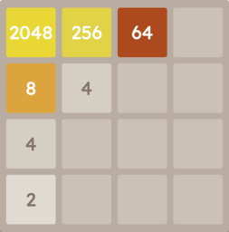

> 🗄️ **Archived**: _This repository is not currently under active development (updates may resume in the future)_
>
> This project was originally created as a curiosity and a learning exercise. Feel free to explore and learn from it, but please note I cannot provide support for it.

# 2048

A clone of the 2048 tile game reimplemented with JavaScript

## About

This implementation of 2048 is designed to replicate the original UI experience and gameplay as close as possible, the only difference being [the move operation](#move-operation). Under the hood, functionality is implemented through the `Game` object that renders the board and computes the logic after each turn, appended via prototype methods.

## Move Operation

For a given direction of tile movement, `Game.prototype.moveTiles(direction)`, the board is read in the opposite direction. For each tile that the read operation encounters, the `Game.prototype.performMoveOperation(tile, cell)` will be called on the tile and each subsequent cell that the tile can be moved. Although this is not how the move operation works in the original game, it proves to be more efficient programmatically and for gameplay.

[Learn more about the original game here.](<https://en.wikipedia.org/wiki/2048_(video_game)>)
